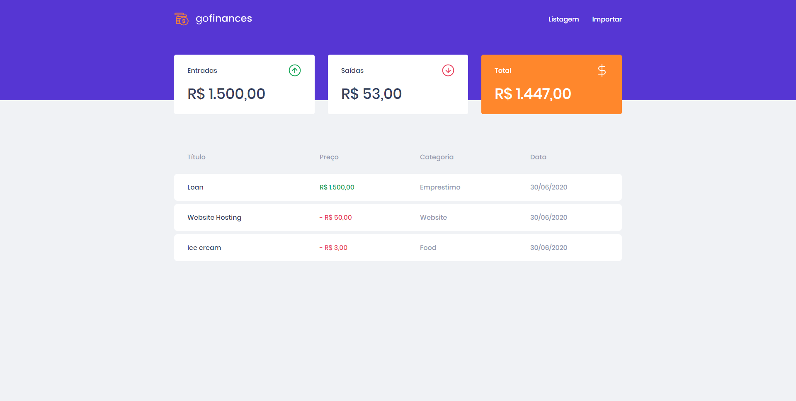
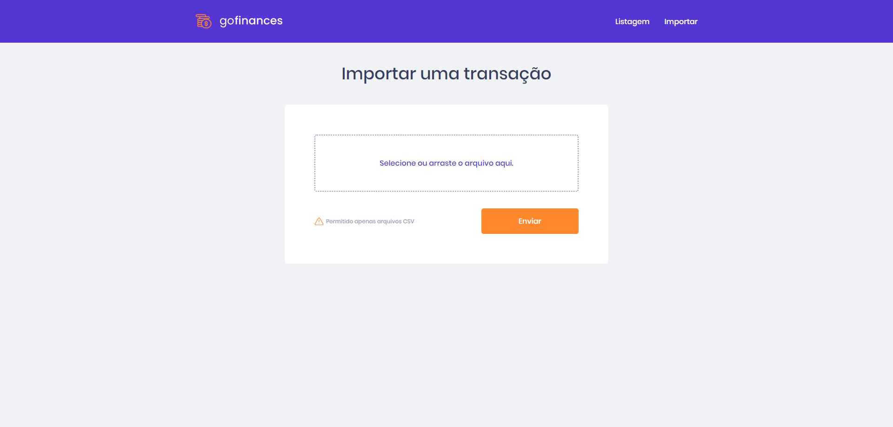

# gofinances
Aplicação para controle de financas - (Front-end: ReactJS, Typescript) (Backend: NodeJS, TypeORM,PostgresSQL)

### Front-end: ReactJS, Typescript
### Backend: NodeJS, TypeORM,PostgresSQL

----------------------------------------------------

----------------------------------------------------

👷 Instalação | 🚀 Execução

Faça um clone desse repositório rodando:

    git clone https://github.com/maiconboer/gofinances.git

Criar um banco de dados Posgtres com nome: 

    gofinances

Abrir terminal na pasta **backend** e instalar dependencias, rode o comando:

    yarn

Ainda na pasta **backend**, rodar as migrations para criação das tabelas, rode o comando:

    yarn typeorm migration:run

Já podemos startar nosso servidor, rode o comando:

    yarn dev:server

----------------------------------------------------

Abrir o terminar na pasta **frontend**, instalar as dependencias, rode o comando:

    yarn

Já podemos startar nosso front-end:

    yarn start

**Pronto, aplicação já rodando!**

Pode ser importado um arquivo csv no seguinte formato 

----------------------------------------------------

### Projeto em fase de desenvolvimento, estou implementando funcionalidades de criar lançamentos além do import do csv (lançamentos pelo frontend)
